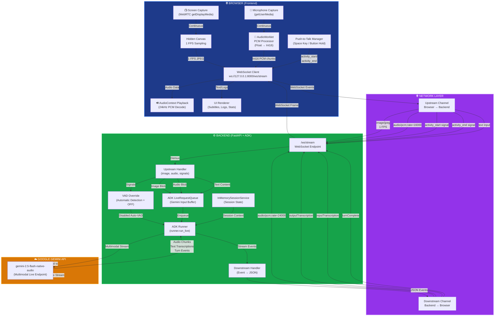

# 🚀 EduMentor Live - AI Bilingual Tutor
**Live Demo:** [https://edumentor-live-278756071986.us-central1.run.app](https://edumentor-live-278756071986.us-central1.run.app)

### ✨ Features
- **Bilingual Support:** Talks and understands both English and Urdu fluently.
- **Multimodal Learning:** Share your screen, and the AI will guide you through your code or documents in real-time.
- **Powered by:** Gemini 2.0 Flash & Google Cloud Run.

EduMentor Live is a real-time multimodal tutoring assistant built for the Google Gemini Live API Hackathon. The system combines live screen context (vision) with low-latency conversational voice (native audio) so a student can share their screen, speak, and receive spoken guidance in the same session.

## Project Overview

EduMentor Live is implemented as:
- A browser client that captures screen frames and microphone audio, then streams both to a backend over one WebSocket.
- A FastAPI backend that relays real-time multimodal input to Gemini Live using Google GenAI ADK bidirectional streaming.
- A return path that streams model events back to the browser, including audio chunks for immediate playback and text transcriptions for subtitles/logs.

## Hackathon Alignment (Gemini Live API)

This project directly targets the core hackathon requirement of real-time multimodal interaction:
- **Native audio:** uses Gemini native audio model configuration with audio response modality enabled.
- **Vision:** sends periodic JPEG frames from shared screen to provide live visual context.
- **Live bidirectional session:** uses ADK live request queue plus streaming responses over a persistent WebSocket.

## Core Technical Features

**1. Gemini native audio integration**
- Backend agent model defaults to: `gemini-2.5-flash-native-audio-preview-12-2025`
- RunConfig is set to bidirectional mode with AUDIO responses
- Input and output transcriptions are enabled in run configuration

**2. Bidirectional WebSocket relay with Google GenAI ADK**
- FastAPI endpoint: `/ws/stream`
- Upstream browser events handled: image, audio, activity_start, activity_end, text
- Downstream model events are forwarded to frontend as raw event JSON from `runner.run_live(...)`
- ADK components used in code: `Agent`, `Runner`, `LiveRequestQueue`, `InMemorySessionService`

**3. Custom Web Audio pipeline (16 kHz PCM upload)**
- Browser microphone is processed using a custom AudioWorklet processor
- Float audio samples are converted into Int16 PCM and sent in fixed chunks
- Audio packets are base64-encoded and transmitted as `type=audio`
- Backend forwards microphone chunks as `audio/pcm;rate=16000` blobs to Gemini Live

**4. Manual VAD override (Push-to-Talk turn control)**
- Automatic activity detection is explicitly disabled in backend realtime input config
- Frontend push-to-talk sends explicit `activity_start` when press begins and `activity_end` when release occurs
- This gives deterministic turn boundaries controlled by user interaction (button hold or Space key)

**5. 1 FPS screen capture stream for visual context**
- Frontend captures display via `getDisplayMedia` (WebRTC)
- A hidden canvas samples frames every 1000 ms
- Each frame is encoded as JPEG and sent to backend as `type=image`
- Backend decodes and forwards each frame as `image/jpeg` blob

**6. Real-time audio playback pipeline**
- Frontend decodes model audio inline data from Base64 PCM
- Int16 PCM is converted to Float32 and scheduled in a 24 kHz AudioContext
- Playback scheduling uses a rolling `nextPlayTime` to reduce gaps between chunks

## System Architecture & Data Flow



### Data Flow Summary

1. **User starts session** in browser UI and grants microphone + screen permissions
2. **Browser opens WebSocket** connection to backend (`/ws/stream`)
3. **Upstream multimodal streams:**
   - 1 FPS JPEG screen frames encoded and sent as `type=image`
   - 16 kHz PCM microphone chunks (while push-to-talk is active) sent as `type=audio`
   - Manual `activity_start` signal when user begins speaking
   - Manual `activity_end` signal when user finishes speaking
4. **Backend enqueues** all inputs into ADK LiveRequestQueue
5. **ADK Runner maintains** continuous bidirectional stream to Gemini Live
6. **Gemini processes** multimodal input (vision + audio context) and generates responses
7. **Backend relays** response events (audio chunks, transcriptions, turn signals) back to browser
8. **Browser renders** streamed audio playback in 24 kHz AudioContext and updates subtitles/logs

## Tech Stack

**Backend**
- Python 3.10
- FastAPI
- Uvicorn
- google-adk (Google GenAI ADK)
- google-genai
- python-dotenv

**Frontend**
- HTML/CSS/Vanilla JavaScript
- WebSocket API
- WebRTC display capture (getDisplayMedia)
- Web Audio API (AudioContext + AudioWorklet)

**Deployment**
- Dockerfile
- Google Cloud Run
- gcloud CLI deployment script (deploy.sh)

## Local Setup

### Prerequisites
- Python 3.10+
- Chromium-based browser (Chrome/Edge)
- A valid GOOGLE_API_KEY in environment file

### 1) Install dependencies
```bash
pip install -r requirements.txt
```

### 2) Create environment file in project root
```dotenv
GOOGLE_API_KEY=your_api_key_here
```

Optional:
```dotenv
AGENT_MODEL=gemini-2.5-flash-native-audio-preview-12-2025
```

### 3) Start backend
```bash
uvicorn main:app --host 127.0.0.1 --port 8000
```

### 4) Open frontend
- Open `index.html` in a Chromium-based browser
- Click "Start Session" and grant microphone and screen permissions
- Hold the push-to-talk button (or Space key) to speak
- Release to let the AI respond

## Google Cloud Run Deployment

This repository includes `deploy.sh` for source-based Cloud Run deployment.

### Prerequisites
- Google Cloud SDK installed and authenticated
- Cloud Run API enabled
- A `.env` file in project root containing GOOGLE_API_KEY

### 1) (Optional) Set project
```bash
gcloud config set project YOUR_PROJECT_ID
```

### 2) Deploy
```bash
bash deploy.sh
```

The script deploys service `edumentor-live` to region `us-central1` and sets:
- `AGENT_MODEL=gemini-2.5-flash-native-audio-preview-12-2025`
- `GOOGLE_API_KEY` from `.env`